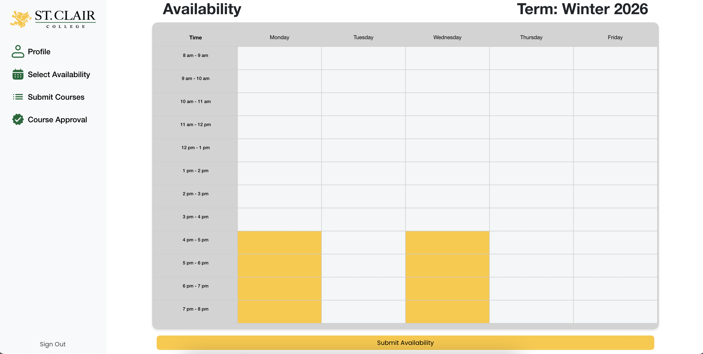

# 📚 Part-Time Portal

A centralized platform designed to streamline part-time teaching assignments for the Zekelman School of Information Technology at St. Clair College.

---

## 💡 Overview

The Part-Time Portal simplifies how administrative staff manage availability, assign courses, and communicate with part-time instructors — all in one place.

This repository is a showcase of the platform’s features and interface.  
**No source code is included.**

---

## 🛠️ Built With

- **Laravel** (PHP Framework)
- **PHP** (Backend logic)
- **MySQL** (Relational Database)
- **Bootstrap** (Frontend layout and UI)

---

## 🖼️ Screenshots

<!-- Login alone -->
### Login Page

---

### Admin Pages

<table>
  <tr>
    <td> Admin dashboard overview</td>
    <td> Searching specific teachers</td>
  </tr>
  <tr>
    <td> All programs, courses, and semesters</td>
    <td> Add programs, courses, or semesters</td>
  </tr>
</table>

---

### Instructor Pages

<table>
  <tr>
    <td> Instructor homepage</td>
    <td> Submitting availability</td>
  </tr>
  <tr>
    <td> Selecting teachable courses</td>
    <td></td>
  </tr>
</table>

---

## 🔗 Live Demo

👉 [Visit the Part-Time Portal](https://ptportal.scweb.ca/ptp14/)

---

## 🔒 Source Code

Due to institutional policies, the source code is not publicly available.  
This repository is intended for **demonstration and portfolio** purposes only.

---

## ✉️ Contact

Created by [Sierra Riley](@sierrariley)  & [Sage Lawrence](@sagelawrence04).
Feel free to reach out via [LinkedIn](https://www.linkedin.com/in/sierra-riley-a4a267146/) or [email](mailto:sierrariley95@gmail.com)

